# Getting started


## About The Project

Apex Agente is a powerful Python application designed to gather data from Trend Micro Apex URL, a cloud-based security platform that provides advanced threat protection for enterprise networks. With Apex Agente, you can easily retrieve all available data from the Apex URL or retrieve specific data by hostname.

The first feature of Apex Agente allows you to retrieve all data from the Apex URL, giving you a comprehensive view of all datas available. This data can include information on host name, entity id, registration ip, and last registration time.

The second feature of Apex Agente allows you to retrieve data specific to a particular host name. This feature is particularly useful if you want to drill down into getting deeper information of a particular host or agent. With this feature, you can retrieve information on a host which included name, entity id, server id, registration ip, connection status, etc.

Apex Agente is easy to use and comes with a simple and intuitive user interface. It is designed to work with Trend Micro Apex URL, so you can be confident that the data you retrieve is accurate and up-to-date. Whether you are a security professional, network administrator, or IT manager, Apex Agente is a must-have tool for monitoring the security status of your network and ensuring that your organization stays safe from potential threats.

## Importing

=== "CLI"

    ```sh
    git clone -b cli https://github.com/ApexAgante/ApexAgente
    ```

=== "GUI"

    ```sh
    git clone -b gui https://github.com/ApexAgante/ApexAgente
    ```

## Installation

### Directory
Go to your project directory by using:
``` bash
cd ApexAgente
```

### Environment <small>optional</small> { #environment }
We recommend using a [virtual environment](https://realpython.com/what-is-pip/#using-pip-in-a-python-virtual-environment), which is an isolated Python runtime. If you are in a virtual environment, any packages that you install or upgrade will be local to the environment. If you run into problems, you can just delete and recreate the environment. It's trivial to set up:

??? poetry "poetry (strongly recommended)"
    - Poetry automatically created virtual environment

    - Activate the environment with:

        === ":material-apple: macOS"

            ``` sh
            poetry shell
            ```

        === ":fontawesome-brands-windows: Windows"

            ``` sh
            poetry shell
            ```

        === ":material-linux: Linux"

            ``` sh
            poetry shell
            ```

    - Exit your virtual environment using:
        
        ``` bash
        exit
        ```

??? pipenv "pipenv (recommended)"
    - Pipenv automatically created virtual environment

    - Activate the environment with:

        === ":material-apple: macOS"

            ``` sh
            pipenv shell
            ```

        === ":fontawesome-brands-windows: Windows"

            ``` sh
            pipenv shell
            ```

        === ":material-linux: Linux"

            ``` sh
            pipenv shell
            ```

    - Exit your virtual environment using:
        
        ``` bash
        exit
        ```

??? python "pip"

    - Create a new virtual environment
        ``` bash
        python3 -m venv venv
        ```
    - Activate the environment with:

        === ":material-apple: macOS"

            ``` sh
            . venv/bin/activate
            ```

        === ":fontawesome-brands-windows: Windows"

            ``` sh
            . venv/Scripts/activate
            ```

        === ":material-linux: Linux"

            ``` sh
            . venv/bin/activate
            ```
    - Exit your virtual environment using:

        ``` bash
        deactivate
        ```

### Dependencies Installation
Apex Agente has several dependencies that can be installed with
`poetry` or `pipenv` or `pip`, ideally by using a [virtual environment](https://docs.python.org/3/library/venv.html). Open up a terminal and install all dependencies with:

=== "poetry"

    ```sh
    poetry install # (1)!
    ```

    1. This will install dependencies with poetry

=== "pipenv"

    ```sh
    pipenv sync # (1)!
    ```

    1. This will install dependencies with pipenv

=== "pip"

    ```sh
    pip install -r requirements.txt # (1)!
    ```

    1. This will install dependencies with python pip

This will automatically install compatible versions of all dependencies. ApexAgente always strives to support the latest versions, so there's no need to install those packages separately.

## Run Locally

To run it locally is pretty simple, just run it with:
=== "poetry"
    
    ``` bash
    poetry run app [--api API KEY] [--id APPLICATION ID] [--url SERVER URL] [--n DEFAULT CONFIGURATION]
    ```

=== "pipenv"

    ``` bash
    pipenv run app [--api API KEY] [--id APPLICATION ID] [--url SERVER URL] [--n DEFAULT CONFIGURATION]
    ```

=== "python"

    ``` bash
    python3 -m app/main.py [--api API KEY] [--id APPLICATION ID] [--url SERVER URL] [--n DEFAULT CONFIGURATION]
    ```

??? info "Information"

    - The `--api` option specifies api key used in the application.
    - The `--id` option specifies application id used in the application.
    - The `--url` option serves as base url for the application.
    - The `--n` options determine whether using the options or use default configuration. If you use `--n` you do not need to use other options
    
    *Note: The program can be run without the need for the user to specify any options.*

## Usage Example

